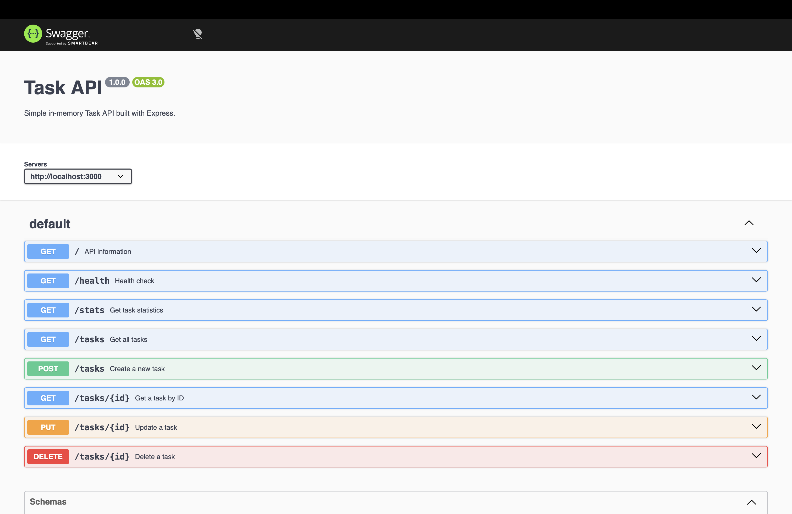

# To Do App API

A lightweight, in-memory RESTful CRUD API built with Node.js and Express.js. This API allows users to manage a to-do list with full support for creating, reading, updating, and deleting tasks, alongside query filtering, title search, and live task metrics. This repository contains the hand-built Express.js To Do API in the root files and the quarantined AI-generated version in [`ai-version/`](ai-version/).

---

## 🚀 How to Install & Run

Ensure you have **Node.js** (v18 or higher) installed on your system.

1. **Clone the repository and install dependencies:**
   ```bash
   git clone <YOUR_GITHUB_REPO_URL>
   cd ToDoAppApi
   npm install
   ```

2. **Start the server (One documented command):**
   ```bash
   node index.mjs
   ```

The server will start at `http://localhost:3000`.

---

## 📌 API Endpoints

| Method | Endpoint | Description | Status Codes |
| :--- | :--- | :--- | :--- |
| **GET** | `/` | API basic metadata and endpoints list | `200` |
| **GET** | `/health` | Server health check | `200` |
| **GET** | `/stats` | Task metrics (total, completed, open) | `200` |
| **GET** | `/tasks` | List all tasks (Supports `?done=true` & `?search=term`) | `200` |
| **GET** | `/tasks/:id` | Fetch a single task by ID | `200`, `404` |
| **POST**| `/tasks` | Create a new task | `201`, `400` |
| **PUT** | `/tasks/:id` | Update task title and completion status | `200`, `400`, `404` |
| **DELETE** | `/tasks/:id` | Delete a task by ID | `204`, `404` |

---

## 💻 Sample `curl -i` Output

Here is a sample terminal output when creating a new task via `POST /tasks`:

```http
curl -i -X POST http://localhost:3000/tasks \
  -H "Content-Type: application/json" \
  -d '{"title": "Complete Stage 6 documentation"}'

HTTP/1.1 201 Created
X-Powered-By: Express
Content-Type: application/json; charset=utf-8
Content-Length: 63
Date: Wed, 29 Jul 2026 10:20:00 GMT
Connection: keep-alive

{"id":4,"title":"Complete Stage 6 documentation","done":false}
```

---

## 📄 Interactive Documentation (Swagger UI)

Interactive OpenAPI documentation is hosted directly at `/docs` using `swagger-ui-express`. You can view, test, and trigger all API routes dynamically from the browser at:

👉 **`http://localhost:3000/docs`**




## AI vs me

### Full prompt used for the AI version

```
So I want you to generate a Node.js backend api using Express.js Framework. The api is about a to do list and there should be tasks stored in in-memory list and the task should have (int : id, string : title, boolean : done) properties. The api should have all crud endpoints. Dont forget to send appropriate status messages for error and success situations. You can also add extra endpoints such as stats, search, and filter by done property. Also make sure to include swagger view as well.

Put all the code in this  folder [ai-version](ai-version/)

```

### Run results

The AI version was placed in [`ai-version/`](ai-version/) and the hand-built root API files were not changed.

It starts successfully with:

```bash
cd ai-version
npm start
```

In this coding sandbox, listening on localhost required elevated execution permission. After that, the initial AI version passed these checkpoint curls:

| Check | Result |
| --- | --- |
| `GET /health` | Pass, `200 OK` |
| `GET /tasks` | Pass, `200 OK` |
| `POST /tasks` with valid title | Pass, `201 Created` |
| `POST /tasks` with blank title | Pass, `400 Bad Request` |
| `GET /tasks/:id` existing task | Pass, `200 OK` |
| `GET /tasks/:id` missing task | Pass, `404 Not Found` |
| `PUT /tasks/:id` | Pass, `200 OK` |
| `PATCH /tasks/:id` | Pass, `200 OK` |
| `DELETE /tasks/:id` | Pass, `200 OK` |
| `GET /tasks?done=false` | Pass, `200 OK` |
| `GET /tasks?search=swagger` | Pass, `200 OK` |
| `GET /tasks?done=maybe` | Pass, `400 Bad Request` |
| `GET /tasks/stats` | Pass, `200 OK` |
| `GET /docs/` | Pass, `200 OK` Swagger HTML |

One curl command initially failed before reaching the API because the URL query string was not quoted in zsh. Quoting the URL fixed it.

### Concrete differences found

1. The AI version handled filtering and search better. It uses one `GET /tasks` route that applies `done` and `search` query parameters together. My hand-built version accidentally defines `GET /tasks` three times, and the later filter/search handlers sit after `app.listen`, so the first `GET /tasks` route wins and query filtering is effectively ignored.

2. The AI version has stronger validation. It rejects non-positive or non-integer IDs with `400`, validates `done` as a real boolean, trims titles, and returns `400` for invalid JSON. My version mostly checks missing titles and missing `done`, but it does not fully validate boolean types or invalid ID formats.

3. The AI version gives consistent response bodies with `success`, `message`, and `data`. My version returns raw task objects or arrays in some places, simple `{ error }` objects in others, and `204 No Content` for delete.

4. The AI version documented every endpoint in Swagger, including query filters and examples. My hand-built API has Swagger, but the implementation and documented behavior are less aligned around search/filter routing.

5. The AI version added `PATCH /tasks/:id`. That was useful, but my first prompt did not ask for PATCH and did not clearly say whether extra endpoints were allowed beyond the required CRUD endpoints.

### What the AI got wrong or decided silently

The AI chose a response envelope format on its own. That is clean, but my prompt did not explicitly require `success`, `message`, and `data` keys.

The AI chose `/tasks/stats` for statistics, while my hand-built version used `/stats`. My prompt asked for a stats endpoint but did not specify its exact path.

The AI returned `200 OK` with the deleted task for delete instead of `204 No Content`. My prompt asked for a clear success response, so this is defensible, but it is a design choice I should have specified.

### What I learned about my prompt

My prompt needed to be stricter about exact response shapes, exact stats route path, whether `PATCH` should exist, and whether `DELETE` should return `200` with JSON or `204` with no body.

### Rematch prompt

```text
Regenerate the Express.js to-do API in ai-version with the same in-memory task model: integer id, string title, boolean done.

Use only Node.js, Express.js, and swagger-ui-express. Do not add a database, authentication, TypeScript, or extra frameworks.

Use these exact routes:
- GET /health
- GET /tasks
- GET /tasks/:id
- POST /tasks
- PUT /tasks/:id
- DELETE /tasks/:id
- GET /tasks/stats
- GET /docs for Swagger UI

Do not add PATCH.

Use GET /tasks query parameters for both optional features:
- done=true or done=false filters by completion status.
- search=text performs a case-insensitive title search.
- If both are present, apply both.

Use this exact JSON envelope for successful JSON responses:
{
  "success": true,
  "message": "short message",
  "data": ...
}

Use this exact JSON envelope for errors:
{
  "success": false,
  "message": "short error message"
}

Status code rules:
- 200 for successful reads and updates.
- 201 for successful creates.
- 204 for successful deletes with no response body.
- 400 for blank title, invalid id format, invalid done type, invalid done filter, and invalid JSON.
- 404 for missing tasks and unknown routes.

Swagger/OpenAPI must document every route, request body, response body, status code, and query parameter.
Keep the code simple and put reusable validation helpers near the routes.
```

Rematch result: the improved prompt removes ambiguity around response format, stats path, PATCH, delete status code, and combined filtering behavior. I kept the `ai-version` folder as the initial AI output so the experiment stays unbiased.
